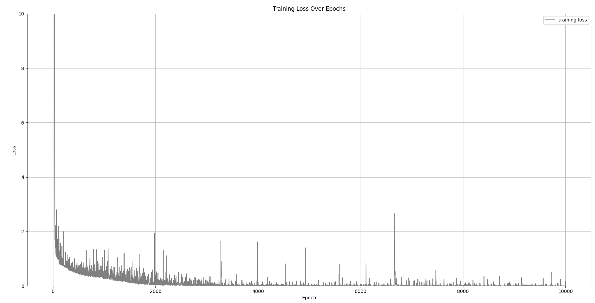
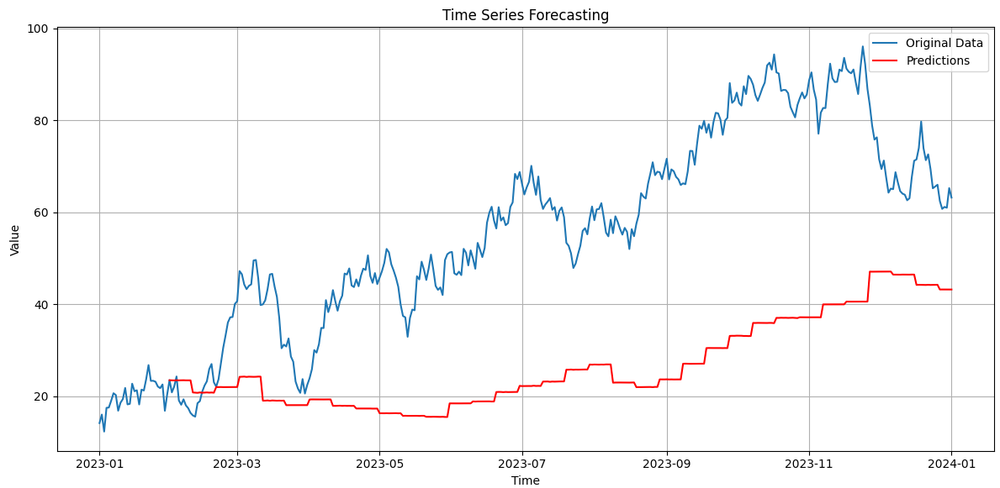

# LSTM_by_JAX

Build the time-series data forcating Using JAX.

```python
# single LSTM layer
# TODO : Multi layer structure / statful LSTM develop.
#      : improving the computing efficiency.
batch_size = 32
input_dim = 1
num_epochs = 10000
lr= 0.001
```



``` shell
Epoch 9000, Loss: 0.0004633401695173234
 Training is done.
 Total execution time is 613.8410 sec.
```



Loss is small enough but forecasting performance is bad.
Needs more code implementation, tuning and study more about JAX.